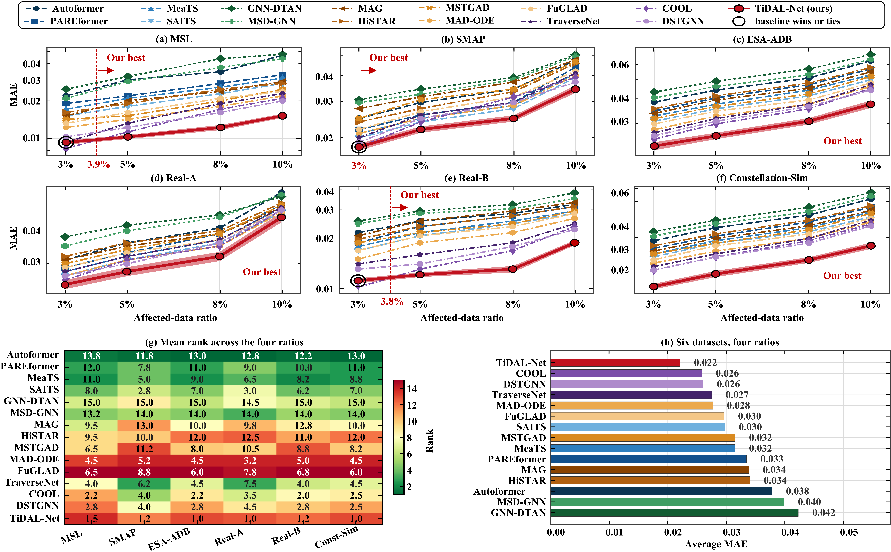
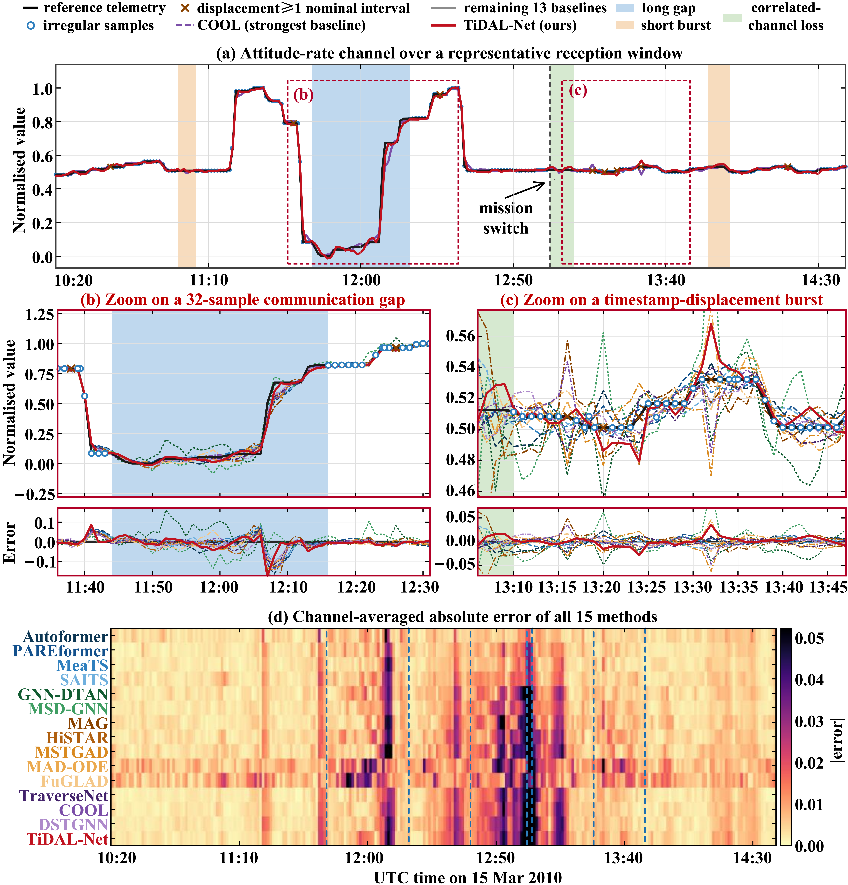
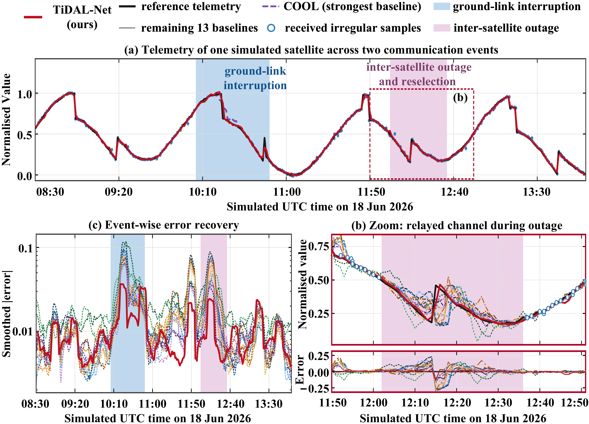
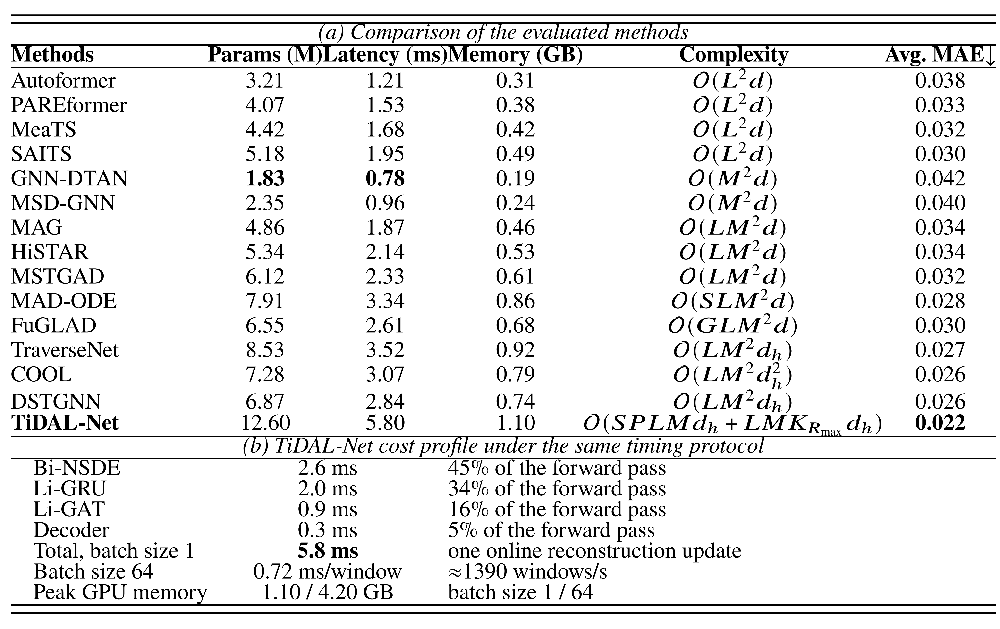
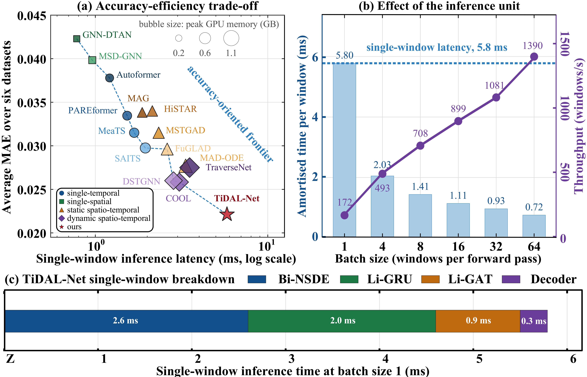

# TiDAL-Net


[](pyproject.toml)
[](LICENSE)

> **Important: review-stage restricted release.** The manuscript associated with this repository is currently under revision and peer review. This repository is an interim technical release rather than the final paper-exact reproducibility package. It provides the main TiDAL-Net architecture, executable examples, data-interface definitions, and the overall training and evaluation workflow. Selected key implementation details, final experimental parameters, processed data assets, and the complete datasets used in the paper are temporarily withheld during the review process. The complete paper-exact code, configurations, manifests, checkpoints, and datasets will be released after the manuscript is accepted, subject to the licenses and data-sharing requirements of the original data owners.

## Review-stage availability statement

The current repository is intended to document the methodological structure and allow readers to inspect and test the main software pipeline. It should **not** be treated as the final archival package for reproducing every numerical result reported in the revised manuscript.

During the revision and peer-review period, the following materials are intentionally not fully disclosed:

- exact channel selections and ordered channel manifests used for each dataset;
- exact train, validation, and test boundaries and all paper-specific sample indices;
- final loss weights, model dimensions, solver settings, graph thresholds, and other key hyperparameters;
- final frozen dataset-specific corruption manifests and empirical per-dataset mixture tables used for the accepted-paper archive;
- the final random seeds, corruption masks, normalization statistics, checkpoints, and training logs used to generate the paper tables;
- the complete processed datasets and the full Real-A, Real-B, and Constellation-Sim data packages;
- paper-exact scripts for reproducing every table, figure, ablation, and sensitivity result.

After acceptance, the authors plan to publish a paper-exact archival release containing:

- the complete source code corresponding to the accepted manuscript;
- all final configuration files, channel manifests, split files, corruption manifests, and experimental seeds;
- pretrained checkpoints, training logs, and scripts for reproducing the reported tables and figures;
- the complete datasets used in the experiments where redistribution is legally and contractually permitted;
- for third-party datasets that cannot be redistributed directly, the exact official download sources, release versions, checksums, channel selections, and preprocessing scripts required to reconstruct the paper datasets;
- release notes that map the accepted manuscript equations, experiments, and tables to the corresponding code and data files.

All currently substituted values are explicitly marked as `REVIEW_DEFAULT` or `AUTHOR_REQUIRED`. They are runnable placeholders and must not be interpreted as the final parameter values used in the revised manuscript.

## What is implemented

TiDAL-Net is a closed-loop reconstruction framework:

1. **Bi-NSDE** propagates forward and backward stochastic latent trajectories with Euler–Maruyama integration, Monte Carlo uncertainty, MIC-neighbor-conditioned drift, variance/distance-aware fusion, and a mask-aware residual gate.
2. **Li-GRU** uses positive input- and state-dependent liquid time constants conditioned on compensated values, elapsed time, local variation, Bi-NSDE uncertainty, channel embeddings, and graph feedback.
3. **Li-GAT** dynamically selects a prior-constrained local graph from a training-only MIC candidate graph, reweights edges using temporal compatibility and hidden-state similarity, and returns graph feedback to the next recurrent update.

The repository distinguishes missing observations from timestamp-displaced observations. Missing and drift sets are disjoint. The public generator now exposes the complete degradation mechanics: isolated loss, short bursts, log-normal long gaps, correlated-channel loss, Gaussian jitter, heavy-tailed transient offsets, accumulated drift, and reset drift. Missing values are concealed only from the received input (`received_values=0`, `observation_mask=0`) while the original reference value is retained for evaluation. Timestamp-displaced values remain received; only their physical event times change through `observation_times = reference_times + timestamp_offsets`. Offsets are generated in nominal sampling intervals and converted to the physical time unit of the input timeline. The generator also records operator IDs, realized counts, and the resolved configuration in every corrupted NPZ. See [`docs/CORRUPTION_PROTOCOL.md`](docs/CORRUPTION_PROTOCOL.md).

## Reproducibility status

Because the associated manuscript is still under revision, the present repository does not expose every numerical value and data asset used in the revised experiments. Consequently:

- settings explicitly present in the original submission are preserved in `configs/base.yaml`;
- review-stage defaults needed to make the code immediately runnable are marked `REVIEW_DEFAULT`;
- every unresolved value is listed in [`docs/AUTHOR_CHECKLIST.md`](docs/AUTHOR_CHECKLIST.md);
- no unpublished result table is hard-coded or fabricated.

The current version supports software inspection and pipeline-level testing, but it is not expected to reproduce the final numerical tables exactly. After acceptance, all `REVIEW_DEFAULT` and `AUTHOR_REQUIRED` entries will be replaced with the paper-exact settings and archived in a versioned release.

## Installation

```bash
conda env create -f environment.yml
conda activate tidalnet
pip install -e .
```

A standard virtual environment also works:

```bash
python -m venv .venv
source .venv/bin/activate       # Windows: .venv\\Scripts\\activate
pip install -U pip
pip install -e .[dev]
```

## Five-minute smoke test

```bash
python scripts/make_demo_data.py --output data/processed/demo.npz
python scripts/build_mic_graph.py --input data/processed/demo.npz --output data/graphs/demo_mic.npy
python scripts/generate_corruptions.py \
  --input data/processed/demo.npz \
  --graph data/graphs/demo_mic.npy \
  --config configs/corruption/reality_informed.yaml \
  --dataset esa_adb \
  --output data/processed/demo_corrupted.npz \
  --ratio 0.05 --seed 2026
python scripts/train.py --config configs/smoke.yaml
python scripts/evaluate.py --config configs/smoke.yaml --checkpoint outputs/smoke/best.pt
```

Or run:

```bash
bash scripts/reproduce_smoke.sh
```

### Exact degradation semantics

For a requested affected-data ratio, only positions with `natural_mask=1` are eligible. The public protocol first divides the affected positions into missing observations and timestamp displacement. Missing observations are removed from the received stream but kept in the reference array as evaluation targets. Timestamp-displaced observations retain their values and masks, while their event times are shifted by a nonzero offset. The four missingness operators and four timestamp processes, ratio-dependent mixtures, gap-length calibration, collision handling, and the audit arrays saved in each NPZ are specified in [`docs/CORRUPTION_PROTOCOL.md`](docs/CORRUPTION_PROTOCOL.md).

The default generator operates independently inside the chronological training, validation, and test splits. A generated corruption NPZ is immutable for a paired experiment and must be reused by TiDAL-Net and all baselines. Use `--global-mask` only when intentionally testing a single whole-sequence corruption realization.

## Dataset availability during review

The current review-stage repository does not redistribute the complete experimental datasets or the final processed data files. Dataset interfaces and preliminary download or conversion utilities are provided for:

- NASA MSL and SMAP telemetry benchmark data;
- ESA anomaly-detection benchmark data;
- user-supplied CSV/NPZ telemetry matrices;
- private Real-A/Real-B and Constellation-Sim through schema-only adapters.

```bash
python scripts/download_public_data.py --dataset nasa --root data/raw
python scripts/download_public_data.py --dataset esa-adb --root data/raw
python scripts/preprocess_public.py --dataset msl --config configs/datasets/msl.yaml
```

The exact channel selections, release versions, preprocessing manifests, split files, and checksums used in the revised paper are temporarily withheld and will be added to the accepted-paper release. The current manifests are examples for testing the software interface and are deliberately separated from the paper-exact manifests.

## Main experiments

```bash
# Generate fixed corruption files once; all methods reuse the same files.
python scripts/prepare_experiment.py --config configs/experiments/main.yaml

# 30 paired runs with identical seeds and affected positions.
python scripts/run_repeated.py --config configs/base.yaml --runs 30 --ratio 0.05

# Aggregate mean, standard deviation, confidence intervals, and paired tests.
python scripts/aggregate_runs.py --input outputs/main --output outputs/main/summary.csv
```

## Complete results for all 14 baselines

The `†` marker in Table II, Figs. 3--5, Table V, and Fig. 7 of the manuscript points to this section. TiDAL-Net is evaluated against 14 baseline methods, while the manuscript presents 10 representative baselines because of space limitations. The complete comparison covers four groups:

- **Temporal:** Autoformer, PAREformer, MeaTS, and SAITS;
- **Spatial:** GNN-DTAN and MSD-GNN;
- **Static spatio-temporal:** MAG, HiSTAR, MSTGAD, MAD-ODE, and FuGLAD;
- **Dynamic spatio-temporal:** TraverseNet, COOL, and DSTGNN.

The full-resolution files are organized under `results/full_baseline_comparison/`.

### Table II — Reconstruction performance

Table II reports the complete reconstruction results of all 14 baselines and TiDAL-Net on MSL, SMAP, ESA-ADB, Real-A, Real-B, and Const-Sim. MAE and RMSE are evaluated at affected-data ratios of 3%, 5%, 8%, and 10%. Values are reported as mean ± standard deviation over 30 runs, together with the Holm-adjusted MAE significance results.


This table supports direct comparison across datasets and degradation levels. It also shows how the relative advantage of TiDAL-Net changes as the affected-data ratio increases.

### Fig. 3 — Overall reconstruction comparison

Fig. 3 summarizes the principal accuracy comparison. Panels (a)--(f) show the MAE trends on the six datasets as the affected-data ratio increases, while panels (g)--(h) compare the average performance and overall ranking of all methods.



The figure shows that conventional temporal, spatial, and spatio-temporal models degrade differently under increasingly irregular telemetry. TiDAL-Net achieves the lowest overall error above an affected-data ratio of approximately 3.9%, and its advantage becomes clearer under more severe degradation.

### Fig. 4 — Real-B reconstruction case

Fig. 4 presents a representative Real-B case at the 5% affected-data ratio. It includes a communication gap and a timestamp-displacement interval, allowing the methods to be compared in terms of trajectory continuity, amplitude recovery, phase alignment, and residual error.



The communication-gap segment evaluates recovery when observations are unavailable, whereas the timestamp-displacement segment evaluates whether a method can account for the actual acquisition time rather than relying only on sample indices.

### Fig. 5 — Constellation reconstruction case

Fig. 5 shows a representative constellation event sequence containing a ground-link outage, an inter-satellite link failure, and subsequent link reselection. The figure compares reconstruction errors during link interruption and the recovery behavior after communication becomes available again.



This case evaluates whether each method can adapt to changing communication reachability. TiDAL-Net uses the current reachability mask to suppress unavailable relations and reweight the remaining valid cross-satellite information.

### Table V — Computational cost and accuracy

Table V compares all methods in terms of trainable parameters, single-window latency at batch size 1, peak GPU memory, computational complexity, and average MAE. It also reports the cost profile of Bi-NSDE, Li-GRU, Li-GAT, and the decoder, together with batch-64 throughput.



The table provides a direct view of the accuracy–efficiency trade-off. Although TiDAL-Net has a higher model cost, its 5.80 ms single-window latency remains well below the assessed telemetry query interval, while batch processing reduces the amortized latency to 0.72 ms per window.

### Fig. 7 — Accuracy–efficiency trade-off

Fig. 7 visualizes the relationship among reconstruction accuracy, latency, memory consumption, and throughput for all evaluated methods. It complements Table V by showing whether improvements in reconstruction accuracy are obtained at a practical computational cost.



The figure highlights the operating position of TiDAL-Net relative to lightweight and high-capacity baselines. It shows that TiDAL-Net maintains online reconstruction capability while providing the lowest average reconstruction error.

## Repository map

```text
configs/                    paper, dataset, ablation, and sensitivity configs
data/manifests/             committed channel/split/corruption manifests
docs/                       reproducibility and paper-to-code documentation
results/full_baseline_comparison/
                            complete 14-baseline tables and figures
scripts/                    data, training, evaluation, statistics, and latency CLIs
src/tidalnet/data/          schemas, normalization, windows, corruption operators
src/tidalnet/graph/         training-only MIC graph construction
src/tidalnet/models/        Bi-NSDE, Li-GRU, Li-GAT, TiDAL-Net
src/tidalnet/training/      losses, trainer, checkpointing
src/tidalnet/evaluation/    metrics and paired statistical tests
tests/                      deterministic unit and smoke tests
```

## Complete data release plan

The authors intend to release the complete datasets used in the paper after acceptance. This includes the final processed public benchmark data and the releasable versions of Real-A, Real-B, and Constellation-Sim. Any release of spacecraft or third-party data will remain subject to data-owner authorization, confidentiality requirements, and the original dataset licenses. Where direct redistribution is not permitted, the accepted-paper release will provide the maximum reproducible alternative, including exact access instructions, immutable source versions, checksums, channel manifests, split indices, corruption masks and seeds, normalization statistics, and preprocessing scripts. See [`docs/PRIVATE_DATA_RELEASE.md`](docs/PRIVATE_DATA_RELEASE.md).

## Citation

The manuscript is under review. Use the placeholder citation in `CITATION.cff` until bibliographic metadata are final.

## License

Code is released under the MIT License. Third-party datasets and baseline implementations retain their original licenses.
